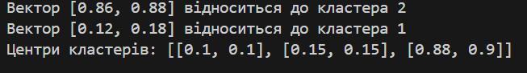

# ART_algo

Цей проект реалізує алгоритм **ART**. ART дозволяє автоматично створювати кластери і розподіляти нові вектори на основі їх схожості з уже існуючими кластерами.

## Мета

Реалізувати алгоритм ART для автоматичного формування кластерів на основі схожості з можливістю класифікації нових векторів у наявні кластери або створення нових кластерів при недостатній схожості.

## Огляд

ART використовує поріг схожості для визначення того, чи належить новий вектор до існуючого кластера, або якщо схожого кластера не знайдено, створює новий. У цьому алгоритмі вектори порівнюються з центрами існуючих кластерів, якщо схожість перевищує порогове значення (`vigilance`), вектор додається до цього кластера. Інакше створюється новий кластер з центром у цьому векторі.

### Яку задачу вирішує?
Алгоритм кластеризує вхідні вектори на основі схожості, визначеної параметром `vigilance`. Це корисно для адаптивного групування векторів, яке дозволяє автоматично створювати нові кластери, коли з'являються вектори, що не відповідають жодному з існуючих кластерів.

### Які дані на вході?
На вхід алгоритму подаються такі параметри:
- **vigilance**: Поріг схожості, при якому вектор може бути доданий до кластера.
- **input_vectors**: Набір векторів, що використовуються для тренування і кластеризації.

### Що на виході?
- **Список кластерів**: Центри кластерів, створених на основі вхідних даних.
- **Класифікація нових векторів**: Індекс кластера для кожного нового вектора, що визначає його кластер на основі максимальної схожості.
